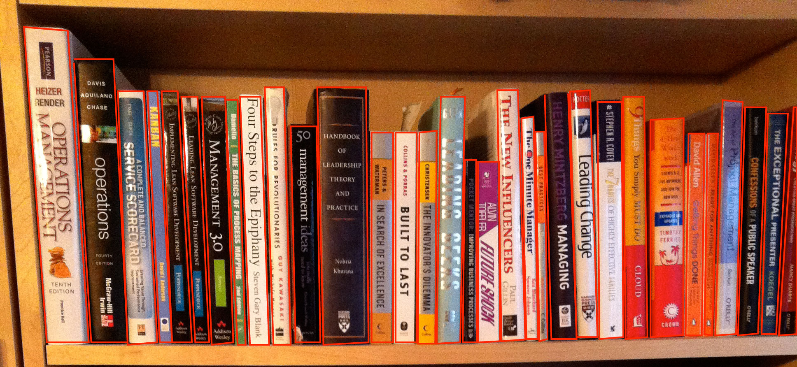

# Node Image Recognition / Machine Learning

This program is an attempt to learn the best arguments to set into OpenCV to get the output that open OpenCV spits out:


To look like this, my desired result:



## Summary

I have a project in mind that would allow me to get book titles from an image of books on a bookshelf. This broad project is two fold.

1. Capturing the book spines
2. Running OCR on the book spine

__This repository focuses on the first part. Capturing the spines.__

## Image Recognition

This project uses [OpenCV](http://opencv.org/), the a computer vision library. More specifically it uses the node port aptly named [node-opencv](https://github.com/peterbraden/node-opencv) Because I'm trying to capture books, the main OpenCV function I'm using is [`houghLinesP()`](http://docs.opencv.org/modules/imgproc/doc/feature_detection.html?highlight=houghlinesp#houghlinesp) it's job is to find line segments in an image. Once you have the points for these line-segments you can select the area of pixels between the points and crop that piece out of the image, my intention is to do just this, and feed those pixels into OCR using [Tesseract](https://code.google.com/p/tesseract-ocr/).

From my understanding and experience you don't want to feed the raw image into the `houghLinesP()` function, it's takes forever because there are so many lines. So what's done in the computer vision field is lots and lots of preprocessing, that preps the image so that the OpenCV functions like `houghLinesP()` have a more concise data set, and can do their job better. One of the preprocessing functions is [`canny()`](http://docs.opencv.org/modules/imgproc/doc/feature_detection.html?highlight=canny#canny) it's job is to find edges, it exports a very crude black and white version of the image, with the edges in white. The image resulting from the `canny()` function is fed into `houghLinesP()`, which exports an array of line segments. To give a visual output of what's happening can color in these line segments and place them on the original image then export it.

In node.js the `canny()` and `houghLinesP()` take the following arguments

```
canny(threshold1, threshold2)
houghLinesP(rho, theta, threshold)
```

I've played around with these 5 arguments to have a little bit of understanding about how they work, but ultimately getting the line-segments I want is a crap-shoot. There's a ton of different combinations for these 5 arguments, and I felt as if I wasn't getting the results I wanted, so I decided to automate this process. This leads us into our next topic, Machine Learning.

## Machine Learning

I wanted to devise a way to find the perfect combinations of the above function 5 arguments. I wanted the code to write itself.

What I did was I created a copy of the bookshelf image with red squares around each book. It's the `desired` outcome I want from OpenCV. I needed a way to compare the `original` to the new `desired` image, one metric what would specify how different or similar images are from one another. I stumbled upon the node library [`blink-diff`](https://github.com/yahoo/blink-diff). I managed to get a number, when I compared two of the same images it resulted in `0` and when I compared the `desired` (bookshelf with red lines I drew) to the `original` (bookshelf without red lines) I received `69016`, the red lines around the books created that much of a pixel difference from the original. This metric is key, with this one number I can rate the score programmatically whether something is "better" than something else.

The next goal was to randomly generate the arguments above and save the results with the `score` from the image difference. Once some information is in the database, I started to think about different algorithms I could use to iterate and variate over the results that have done the best. Something that I passionately believe in is that no-one algorithm is going to be the _right_ one, the key is to have a diverse range of methods and allow the code produce something that is "better", at any cost. I believe that random mutation is key. Here's some of the methods.

* Pull the best, take the best arguments from the database say the `CANNY_THRESH1` was `166` then get a good range below that number and above that number and generate a new random number based on that one number.
* Pull the best, with randomizing one argument. Same as the first option, except remove the limits for one of the arguments and let that one run based on nothing just the arguments min and max.
* Pull the top `x` get the average.
* Pull the top `x` get the average, then like in the first option variate above and below that number.

There's a ton of these I can come up with, I think I can always keep coming up with new way to iterate over the "best" scores, I think it's important to throw the kitchen sink in and let them all mingle.

> Todo (done): I think it's important to save the method / function / algorithm used to generate the numbers, that way it can be slightly bias to the methods that continuously do better.

All of these options are now being generated in [`machine-learning-options.js`](./machine-learning-options.js), and their rankings are all present within each run.
